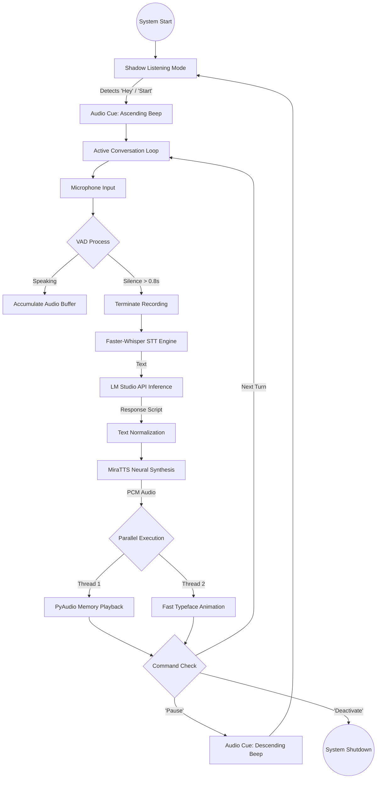

# Project Pipeline Architecture

This document illustrates the technical data flow and component integration of the Voice Conversational AI System.

## Technical Flow Diagram

## Component Roles

### 1. Input Layer (VAD & STT)

- **VAD (Voice Activity Detection)**: Monitors RMS energy levels in real-time. It cuts the recording loop immediately after 800ms of sustained quiet, significantly reducing response latency compared to fixed-length recording.
- **Faster-Whisper**: Processes the audio buffer into text. It uses CTranslate2 backend for high-speed inference on NVIDIA GPUs.

### 2. Cognitive Layer (LLM)

- **LM Studio Gateway**: Acts as the brain. The system sends conversational context to a local OpenAI-compatible endpoint.
- **System Prompting**: Enforces concise, spoken-word friendly responses (1-3 sentences) to maintain conversational speed.

### 3. Synthesis Layer (TTS)

- **MiraTTS**: A neural reference-based synthesis engine. It generates high-fidelity audio tokens from text based on the `reference_file.wav` provided at initialization.
- **Neural Codecs**: Utilizes `ncodec` and `FlashSR` for internal audio super-resolution and decoding.

### 4. Output Layer (Synchronized IO)

- **PyAudio Memory Buffer**: Audio is played directly from RAM. No disk I/O is involved during playback to prevent micro-stutters.
- **Threaded UI**: The terminal typewriter effect runs in a parallel thread, synchronized with a 1.0s lead-in to allow the sound driver to initialize.

## Lifecycle States

| State            | Description                                  | Audio Cue       |
| :--------------- | :------------------------------------------- | :-------------- |
| **Shadow Mode**  | Silent background monitoring for wake-words. | None            |
| **Activation**   | Transition into active conversation.         | Ascending Beep  |
| **Processing**   | Actively transcribing or generating.         | None            |
| **Deactivation** | Transition back into Shadow Mode.            | Descending Beep |
| **Termination**  | Full process shutdown.                       | None            |
