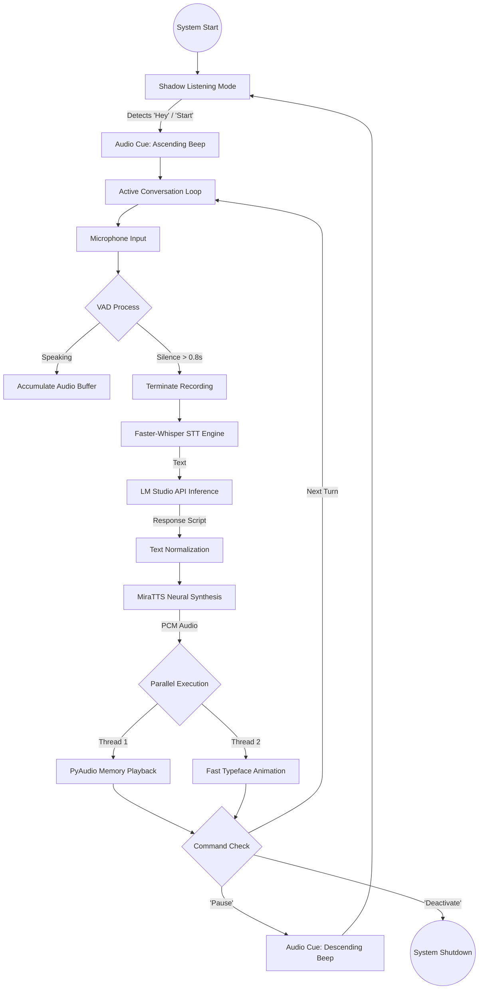

# Conversational AI Fren

## Overview

This project implements a high-performance, low-latency voice conversational pipeline. It integrates Faster-Whisper for Speech-to-Text (STT), LM Studio for Large Language Model (LLM) inference, and MiraTTS for neural Text-to-Speech (TTS).

## Core Components

- **Speech-to-Text**: `faster-whisper` (medium model) utilizing CUDA 12.1 for near-instant transcription.
- **Language Model**: Inference via OpenAI-compatible API (standard port 1234).
- **Text-to-Speech**: `MiraTTS` neural cloning model for natural vocal responses.
- **Logic Engine**: Monolithic Python implementation with asynchronous VAD and threading.

## Features

- **Voice-to-Start**: The system initializes in a silent "Shadow Mode" and activates via wake words ("Start" or "Hey").
- **Voice Activity Detection (VAD)**: Intelligent recording cutoff (0.8s silence threshold) to eliminate fixed-duration delays.
- **Shadow Listening (Pause Mode)**: Background monitoring with zero TUI output. Transition cues are provided via audio beeps.
- **Audio Transition Cues**: When activating and deactivating, the system emits a 1-second beep to signal the transition.

## System Prerequisites

1.  **Python 3.10+**: Recommended for compatibility with `onnxruntime-gpu` and `torch`.
2.  **FFmpeg**: Must be installed and available in the system PATH (used for loudness normalization and silence removal).
3.  **CUDA 12.1 & cuDNN**: Required for GPU acceleration.
4.  **LM Studio**: Local server must be active on `http://127.0.0.1:1234`.

## Quick Start (the easy way)

You can now initialize and run the entire pipeline with a single command using `npx`:

```bash
npx fren-voice
```

This will automatically:

1. Clone the repository (if not already present).
2. Create a virtual environment.
3. Install all CUDA-optimized dependencies.
4. Launch the AI conversation.

---

## Installation (Traditional)

### 1. Prerequisites

- **Python 3.10+**: Download and install from [python.org](https://www.python.org/).
- **Git**: Required to pull specific model repositories.
- **FFmpeg**:
  1. Download and install FFmpeg following the official guides at [ffmpeg.org](https://ffmpeg.org/download.html) or the [official GitHub repository](https://github.com/FFmpeg/FFmpeg).
  2. Ensure the `ffmpeg` executable is added to your system **PATH**.
- **LM Studio**: Install it and load a GGUF model (e.g., Llama 3 or Mistral). Start the Local Server on port 1234.

### 2. Setup Virtual Environment

It is highly recommended to use a virtual environment to manage dependencies:

**Windows:**

```powershell
python -m venv .venv
.\.venv\Scripts\activate
```

**Linux:**

```bash
python3 -m venv .venv
source .venv/bin/activate
```

### 3. Install Dependencies

Install all core engines and CUDA-optimized libraries:

**Windows:**

```powershell
pip install -r requirements.txt
```

**Linux:**

```bash
pip3 install -r requirements.txt
```

### 4. Hardware Verification

Ensure your NVIDIA drivers are up to date. The system will automatically attempt to locate the necessary CUDA/cuDNN DLLs within your site-packages if they are missing from the system path.

## Configuration

- **Reference Voice**: The system requires `reference_file.wav` in the root directory for TTS voice cloning.
- **Microphone**: Defaulted to default input device can also be modified by setting `input_device_index` in the `record_audio_vad` method if necessary.
- **Environment Variables**: The script automatically sets the following for stability:
  - `TM_MAX_CONTEXT_TOKEN_NUM="12000"` (LMDeploy buffer)
  - `ORT_CUDA_DISABLE_CUDNN_FRONTEND="1"` (ONNX CUDA stability)

## Usage

Execute the main script:

**Windows:**

```powershell
python voice_conversation.py
```

**Linux:**

```bash
python3 voice_conversation.py
```

### Voice Commands {Can be changed in the code as requirements}

- **Activate**: "Start", "Hey", or "Continue".
- **Pause**: "Pause", "Exit", "Quit", or "Goodbye".
- **Terminate**: "Deactivate", "Terminate", or "Shut down".

## Project Structure

- `voice_conversation.py`: Core system logic and TUI.
- `requirements.txt`: Unified dependency manifest for CUDA-enabled environments.
- `README.md`: Technical documentation and setup guide.
- `reference_file.wav`: Target voice profile for TTS.
- `MiraTTS.bat` / `.ps1`: Quick-launch scripts.

---

# Project Pipeline Architecture

This section illustrates the technical data flow and component integration of the Voice Conversational AI System.

## Technical Flow Diagram




## Component Roles

### 1. Input Layer (VAD & STT)

- **VAD (Voice Activity Detection)**: Monitors RMS energy levels in real-time. It cuts the recording loop immediately after 800ms of sustained quiet, significantly reducing response latency compared to fixed-length recording.
- **Faster-Whisper**: Processes the audio buffer into text. It uses CTranslate2 backend for high-speed inference on NVIDIA GPUs.

### 2. Cognitive Layer (LLM)

- **LM Studio Gateway**: Acts as the brain. The system sends conversational context to a local OpenAI-compatible endpoint.
- **System Prompting**: Enforces concise, spoken-word friendly responses (1-3 sentences) to maintain conversational speed.

### 3. Synthesis Layer (TTS)

- **MiraTTS**: A neural reference-based synthesis engine. It generates high-fidelity audio tokens from text based on the `reference_file.wav` provided at initialization.
- **Neural Codecs**: Utilizes `ncodec` and `FlashSR` for internal audio super-resolution and decoding.

### 4. Output Layer (Synchronized IO)

- **PyAudio Memory Buffer**: Audio is played directly from RAM. No disk I/O is involved during playback to prevent micro-stutters.
- **Threaded UI**: The terminal typewriter effect runs in a parallel thread, synchronized with a 1.0s lead-in to allow the sound driver to initialize.

## Lifecycle States

| State            | Description                                  | Audio Cue       |
| :--------------- | :------------------------------------------- | :-------------- |
| **Shadow Mode**  | Silent background monitoring for wake-words. | None            |
| **Activation**   | Transition into active conversation.         | Ascending Beep  |
| **Processing**   | Actively transcribing or generating.         | None            |
| **Deactivation** | Transition back into Shadow Mode.            | Descending Beep |
| **Termination**  | Full process shutdown.                       | None            |
